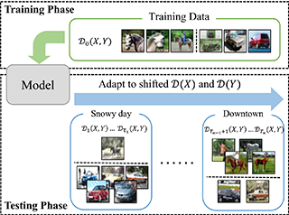








# 🤵🏻 About Me

I am a first-year M.S. student at [the Department of Communication Science and Engineering](https://cse.fudan.edu.cn/) of [Fudan University](https://www.fudan.edu.cn/) advised by Assistant Professor [Niu-tao Liu (柳钮滔)](http://www.it.fudan.edu.cn/En/Data/View/3966), and a member of [EMW Lab (电磁波信息科学教育部重点实验室)](https://emwlab.fudan.edu.cn/), which is led by Professor [Ya-qiu Jin (金亚秋)](http://www.it.fudan.edu.cn/Data/View/1044).

Prior to this, I was fortunate to be advised by Assistant Professor [Yu-dan Ren (任玉丹)](https://faculty.nwu.edu.cn/YudanRen/zh_CN/index/81077/list/index.htm) and completed my undergraduate at [Northwest University](https://www.nwu.edu.cn/).

My current research focus on computer vision and deep learning, especially in low-level field like remote sensing.

<!-- # 🔥 News
- *2022.02*: &nbsp;🎉🎉 Lorem ipsum dolor sit amet, consectetur adipiscing elit. Vivamus ornare aliquet ipsum, ac tempus justo dapibus sit amet. 
- *2022.02*: &nbsp;🎉🎉 Lorem ipsum dolor sit amet, consectetur adipiscing elit. Vivamus ornare aliquet ipsum, ac tempus justo dapibus sit amet.  -->

# 📝 Publication 

<!-- 

ICML 2023

**ODS: Test-Time Adaptation in the Presence of Open-World Data Shift.**

**Zhi Zhou**, Lan-Zhe Guo, Lin-Han Jia, Ding-Chu Zhang, Yu-Feng Li.

In: Proceedings of the 40th International Conference on Machine Learning, Hawaii, 2023. 

Oral Presentation.
[[Paper]](../resources/ICML2023_ODS.pdf) 
[[Code]](https://www.lamda.nju.edu.cn/code_ODS.ashx)
[[Poster]](../resources/ICML2023_ODS_Poster.png)
[[Slide]](../resources/ICML2023_ODS_Slides.pdf) 
[[Video]](https://icml.cc/virtual/2023/poster/24841)

 -->

## Preprint

- **See the Darkest Regions of the Moon with Synthetic Aperture Radar and CycleGAN**  
Tong Xia, Niu-tao Liu*, **Yi Zheng**, Ya-qiu Jin, Feng Xu.  
Under Review in IEEE Transactions on Geoscience and Remote Sensing.  
[[Paper]](./resources/preprint/TGRS-2503.pdf)

# 🎖 Honor

- *2023.12*, [National Scholarship](../resources/NJU2023_NationalScholarship.pdf), Nanjing University.
- *2023.11*, [China Mobile Hackathon - University Joint Research Institute Special Competition in Machine Vision and Artificial Intelligence](../resources/NJU2023_AIHackathon.pdf), Nanjing University.
- *2022.06*, [LAMDA Excellent Student Award](../resources/LAMDA2022_Elite.pdf), Nanjing University.
- *2022.03*, [Tencent Scholarship](../resources/Tencent2021_Scholarship.pdf), Nanjing University.
- *2020.06*, [Top 10 College Student of the Year](../resources/JLU2019_Top10.pdf), Jilin University.
- *2019.12*, [National Scholarship](../resources/JLU2019_NationalScholarship.pdf), Jilin University.
- *2019.10*, CCF Collegiate Computer Systems & Programming Contest, [Gold Medal (11th)](../resources/CCSP2019.pdf), Suzhou.
- *2019.06*, [Tang Aoqing Honors Program of Research & Practice](../resources/JLU2019_TAQScholarship.jpg), Jilin University.
- *2018.12*, ACM-ICPC Asia Regional Contest, [Gold Medal (19th)](../resources/ICPC2018_ECFinal.pdf), EC-Final.
- *2018.11*, [National Scholarship](../resources/JLU2018_NationalScholarship.jpg), Jilin University.
- *2018.10*, ACM-ICPC Asia Regional Contest, [Gold Medal](../resources/ICPC2018_Xuzhou.pdf), Xuzhou.
- *2018.10*, ACM-ICPC Asia Regional Contest, [Gold Medal (16th)](../resources/ICPC2018_Shenyang.pdf), Shenyang.
- *2018.09*, China Collegiate Programming Contest, [Gold Medal (4th)](../resources/CCPC2018_Qinghuangdao.pdf), Qinhuangdao.
- *2018.09*, China Collegiate Programming Contest, [Gold Medal (10th)](../resources/CCPC2018_Jilin.pdf), Jilin.
- *2018.06*, [Tang Aoqing Honors Program of Research & Practice](../resources/JLU2018_TAQScholarship.jpg), Jilin University.
- *2017.11*, [National Scholarship](../resources/JLU2017_NationalScholarship.jpg), Jilin University.

# 🤝 Activity

## Conference Committee

- Senior Program Committee Member, IJCAI 2025.
- Senior Program Committee Member, ACML 2022.
- Program Committee Member, NeurIPS 2022/2023/2024.
- Program Committee Member, ICML 2022/2023/2024/2025.
- Program Committee Member, ICLR 2024/2025.
- Program Committee Member, KDD 2024.
- Program Committee Member, AAAI 2023/2024/2025.
- Program Committee Member, ECAI 2023/2024.

## Journal Reviewer
- Reviewer for Machine Learning Journal (MLJ)
- Reviewer for IEEE Transactions on Knowledge and Data Engineering (TKDE)
- Reviewer for IEEE Transactions on Pattern Analysis and Machine Intelligence (TPAMI)
- Reviewer for IEEE Transactions on Neural Networks and Learning Systems (TNNLS)
- Reviewer for Frontiers of Computer Science (FCS)

## Teaching Assistant
- *2022.02 - 2022.06*, Teaching Assistant for Introduction to Advanced Machine Learning, Nanjing Univeristy.
- *2021.09 - 2022.01*, Teaching Assistant for Introduction to Machine Learning, Nanjing Univeristy.

# 📖 Education
- *2022.09 - Now*, Ph.D., Computer Science and Technology, Nanjing University, Nanjing.
- *2020.09 - 2022.06*, Master, Computer Science and Technology, Nanjing University, Nanjing.
- *2016.09 - 2020.06*. Undergraduate, Tang Aoqing Honors Program (Computer Science and Technology), Jilin University, Jilin.

<!-- # 💬 Invited Talks
- *2021.06*, Lorem ipsum dolor sit amet, consectetur adipiscing elit. Vivamus ornare aliquet ipsum, ac tempus justo dapibus sit amet. 
- *2021.03*, Lorem ipsum dolor sit amet, consectetur adipiscing elit. Vivamus ornare aliquet ipsum, ac tempus justo dapibus sit amet.  \| [\[video\]](https://github.com/) -->